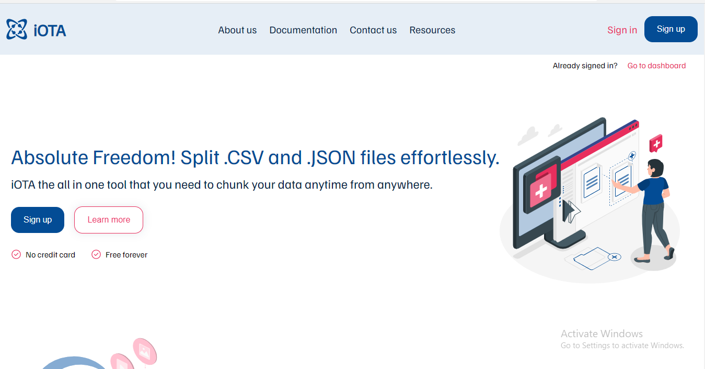

## DEPLOYMENT GUIDE
* Main branch location -[iOTA-main-branch](https://github.com/zuri-training/Chunk-file-team-45)

Clone the project
```
git clone https://github.com/zuri-training/Chunk-file-team-45.git
```
​
Browse to the project folder
```
cd Chunk-file-team-45
```
​
Create a virtual environment 
```
python -m venv chunky_env
```
​
Activate virtual environment
```
cd chunky_env\Scripts
activate
```

Move to project directory under Chunk-file-team-45 dir run​
```
cd chucky
```

Install all dependencies
```
pip install -r requirements.txt
```
​
Make migrations
```
python manage.py makemigrations
```
​
Migrate the database
```
python manage.py migrate
```
​
create superuser 
```
python manage.py createsuperuser
```
​
Create a new branch to work with
```
git branch <new-branch>
```
​
switch to the new branch to make changes
```
git checkout <new-branch>
```
​
Finally, Start The Server.
```
python manage.py runserver
```
* The achitecture is Monolith(Django Templating)
* Project folder (chucky)
* App names (shredit, user)
* Static directory (static)
* Media directory (media)

# Chunk-file-team-45

- [x] This platform was concieved to help people get a better hold of large data processing.

- [x] We discovered that in recent times, businesses and organizations have huge problems working on large files, especially the tabularized files,
hence the essence of this project.

- [x] Our team is a group of people that decides to contribute our own quota to the world by relieveing these businesses or organizations off their stress and 
overwhelming workload when it comes to data processing. 

- [x] A Solution to break files down into bits when the parent file is too large and overwhelming for its users.

- [x] This platform accepts file from users and help them split it into meaningful bits.

- [x] The user gets back the original content of the uploaded file but in chunked pieces with better usability and less overwhelming.

> We named it <strong>iOTA</strong>
<p></p>

# What iOTA does
- [x] iOTA has been designed to accept two file formats which are .csv and .json.

- [x] iOTA will accomodate two major types of users, The Authenticated and Non-Authenticated.

- [x] The unauthenticated user can only visit and interact with the pheripheral parts of the platform, but can't perform any 
major task, such as spliting or chuncking.
- [x] The authenticated(logged in)user can perform all the actions allowed on the platform.

# Platform Features
* Authentication
* Authorization
* Dedicated File storage
* Spliting of CSV files
* Spliting of JSON files
* Sharing and downloadable links
* Reviewing recent activities

More mindblowing features are comming soon, Watchout for iOTA.


# Project Stacks
* Python
* Django
* Javascript
* CSS
* HTML

- [x] HTML, CSS and Javascript are used to design the frontend while we deploy Python and it's Django framework for the Backend
The user authentication is done with with Django inbuilt auth system  and the file splitting is done with python.


# Documentations
- Figma Board
https://www.figma.com/file/u1asikejW1s1pF9NU51pPd/FIGMA---Chunk-file%2FTEAM-45?node-id=480%3A339


# Database Schema
 

# iOTA Page


